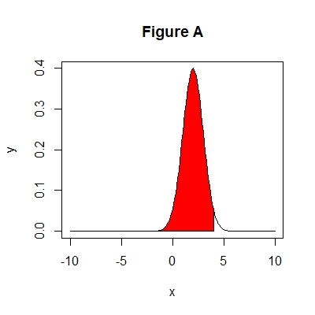
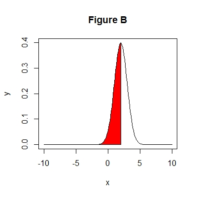
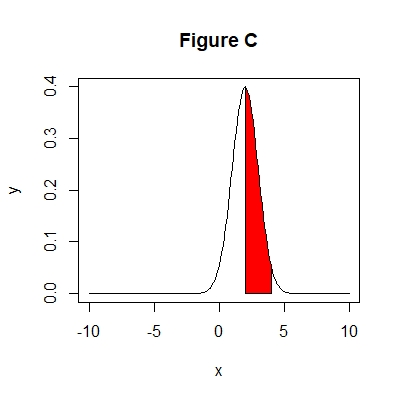

```{r setup, include=FALSE}
htmltools::tagList(rmarkdown::html_dependency_font_awesome())
```


```{r, echo = FALSE, purl = FALSE}
knitr::knit_hooks$set(purl = knitr::hook_purl)

options(purl = FALSE)

knitr::opts_chunk$set(purl = FALSE)
```

```{r, include = FALSE}
knitr::opts_hooks$set(eval = function(opt) {
  if (any(opt$exercise))
    opt$eval <- opt$include <- FALSE
  
  opt
})


static <- TRUE

options(width = 100)

```


```{r packages, include = FALSE}
library(kableExtra)
library(knitr)
```


```{r load_data, context="data", include=FALSE}
library(survival)
```


## Preface {data-progressive=FALSE}

Open Rstudio to do the practicals. Note that tasks with * are optional.

_`r R.version.string`_


### Normal distribution {.tabset .tabset-fade .tabset-pills}

```{r, eval = static, echo = FALSE}
asis_output("#### Task 1\\n")
```

```{r, eval = static, echo = FALSE}
asis_output('<div style="border:2px; border-style:solid; padding: 1em; border-color:#0c2074">')
```

* Define a set of approximately 100 equally spaced values between -5 and +5. 
* Plot the standard normal density function (mean = 0, sd = 1).


```{r normal1_hint, eval = static, results = 'asis', echo = FALSE}
cat('<button type="button" class="btn btn-info btn-sm" data-toggle="collapse" data-target="#normal1">Hint</button>
<div id = "normal1" class="collapse" style="border:1px; border-style:solid; padding: 1em; border-color:#6d79ac">
Use the function seq(...) to generate a sequence. Use the function dnorm(...) for the normal density function.
</div>')
```


```{r, eval = static, echo = FALSE}
asis_output("</div>")

asis_output("#### Solution 1\\n")
```

```{r normal1-solution, solution = TRUE}
x <- seq(from = -5, to = 5, by = 0.1)
y <- dnorm(x)
plot(x, y, type = "l", col = "red", lwd = 2, 
     main = "Standard normal density function")
```


```{r, eval = static, echo = FALSE}
asis_output("#### Task 2\\n")
```

```{r, eval = static, echo = FALSE}
asis_output('<div style="border:2px; border-style:solid; padding: 1em; border-color:#0c2074">')
```

* Define a set of approximately 100 equally spaced values between -10 and +10.
* Plot a normal density function of mean 2 and standard deviation 1.


```{r normal2_hint, eval = static, results = 'asis', echo = FALSE}
cat('<button type="button" class="btn btn-info btn-sm" data-toggle="collapse" data-target="#normal2">Hint</button>
<div id = "normal2" class="collapse" style="border:1px; border-style:solid; padding: 1em; border-color:#6d79ac">
Use the function dnorm(...) for the normal density function. Check the arguments mean and sd.
</div>')
```


```{r, eval = static, echo = FALSE}
asis_output("</div>")

asis_output("#### Solution 2\\n")
```

```{r normal2-solution, solution = TRUE}
x <- seq(from = -10, to = 10, by = 0.2)
y <- dnorm(x, mean = 2, sd = 1)
plot(x, y, type = "l", col = "red", lwd = 2, 
     main = "Standard normal density function")
```


```{r, eval = static, echo = FALSE}
asis_output("#### Task 3\\n")
```

```{r, eval = static, echo = FALSE}
asis_output('<div style="border:2px; border-style:solid; padding: 1em; border-color:#0c2074">')
```

* Define a set of 100 equally spaced values between -10 and +10.
* Calculate the probability to observe a value smaller or equal than 3, in a normal distribution of mean = 2 and sd = 1.
* Calculate the 50th quantile of the standard normal distribution.
* Calculate the 95th quantile of the standard normal distribution.

```{r normal3_hint, eval = static, results = 'asis', echo = FALSE}
cat('<button type="button" class="btn btn-info btn-sm" data-toggle="collapse" data-target="#normal3">Hint</button>
<div id = "normal3" class="collapse" style="border:1px; border-style:solid; padding: 1em; border-color:#6d79ac">
Use the function pnorm(...) for the normal cumulative distribution function (cdf). Use the function qnorm(...) for the inverse of the cdf.
</div>')
```


```{r, eval = static, echo = FALSE}
asis_output("</div>")

asis_output("#### Solution 3\\n")
```

```{r normal3-solution, solution = TRUE}
x <- seq(from = -10, to = 10, by = 0.2)
pnorm(q = 3, mean = 2, sd = 1)
qnorm(0.5)
qnorm(0.95)
```


```{r, eval = static, echo = FALSE}
asis_output("#### Task 4*\\n")
```

```{r, eval = static, echo = FALSE}
asis_output('<div style="border:2px; border-style:solid; padding: 1em; border-color:#0c2074">')
```

* Define a set of approximately 100 equally spaced values between -10 and +10.
* Calculate the probability to observe a value larger than 3, in a normal distribution of mean = 2 and sd = 1.

```{r normal4_hint, eval = static, results = 'asis', echo = FALSE}
cat('<button type="button" class="btn btn-info btn-sm" data-toggle="collapse" data-target="#normal4">Hint</button>
<div id = "normal4" class="collapse" style="border:1px; border-style:solid; padding: 1em; border-color:#6d79ac">
Use the function pnorm(...) for the normal cumulative distribution function (cdf).
</div>')
```


```{r, eval = static, echo = FALSE}
asis_output("</div>")

asis_output("#### Solution 4*\\n")
```

```{r normal4-solution, solution = TRUE}
x <- seq(from = -10, to = 10, by = 0.2)
pnorm(q = 3, mean = 2, sd = 1, lower.tail = FALSE)
```


```{r, eval = static, echo = FALSE}
asis_output("#### Task 5*\\n")
```

```{r, eval = static, echo = FALSE}
asis_output('<div style="border:2px; border-style:solid; padding: 1em; border-color:#0c2074">')
```

* Define a set of approximately 100 equally spaced values between -10 and +10.
* What is the probability to observe a value between 2 and 4 in a normal distribution of mean = 2 and sd = 1 ?

```{r normal5_hint, eval = static, results = 'asis', echo = FALSE}
cat('<button type="button" class="btn btn-info btn-sm" data-toggle="collapse" data-target="#normal5">Hint</button>
<div id = "normal5" class="collapse" style="border:1px; border-style:solid; padding: 1em; border-color:#6d79ac">
Use the function pnorm(...) for the normal cumulative distribution function (cdf). Figure C = Figure A - Figure B:



</div>')
```


```{r, eval = static, echo = FALSE}
asis_output("</div>")

asis_output("#### Solution 5*\\n")
```

```{r normal5-solution, solution = TRUE}
x <- seq(from = -10, to = 10, by = 0.2)
pnorm(q = 4, mean = 2, sd = 1) - pnorm(2, mean = 2, sd = 1)
```


### $t$ distribution {.tabset .tabset-fade .tabset-pills}

```{r, eval = static, echo = FALSE}
asis_output("#### Task 1\\n")
```

```{r, eval = static, echo = FALSE}
asis_output('<div style="border:2px; border-style:solid; padding: 1em; border-color:#0c2074">')
```

* Generate 50 random values from the t-distribution. Recall that the number of degrees of freedom for a t-distribution is equal to the sample size minus one.
* Plot the above created values as a histogram


```{r t1_hint, eval = static, results = 'asis', echo = FALSE}
cat('<button type="button" class="btn btn-info btn-sm" data-toggle="collapse" data-target="#t1">Hint</button>
<div id = "t1" class="collapse" style="border:1px; border-style:solid; padding: 1em; border-color:#6d79ac">
Use the function rt(...) to generate random values from the t-distribution.
</div>')
```


```{r, eval = static, echo = FALSE}
asis_output("</div>")

asis_output("#### Solution 1\\n")
```

```{r t1-solution, solution = TRUE}
x <- rt(n = 50, df = 50 - 1)
hist(x)
```


```{r, eval = static, echo = FALSE}
asis_output("#### Task 2\\n")
```

```{r, eval = static, echo = FALSE}
asis_output('<div style="border:2px; border-style:solid; padding: 1em; border-color:#0c2074">')
```

* Construct a t-distribution with df = 6 and calculate the probability density function at t = -6, −4, −2, 0, 2, 4, 6.
* Calculate the area under the t-curve for the intervals (-inf, -2] and (2, inf) for a random variable following a t-distribution with df = 6.


```{r t2_hint, eval = static, results = 'asis', echo = FALSE}
cat('<button type="button" class="btn btn-info btn-sm" data-toggle="collapse" data-target="#t2">Hint</button>
<div id = "t2" class="collapse" style="border:1px; border-style:solid; padding: 1em; border-color:#6d79ac">
Use the function dt(...) for the probability density function from the t-distribution. Use the function pt(...) for the cumulative distribution function.
</div>')
```


```{r, eval = static, echo = FALSE}
asis_output("</div>")

asis_output("#### Solution 2\\n")
```

```{r t2-solution, solution = TRUE}
x <- c(6, -4, -2, 0, 2, 4, 6)
dt(x, df = 6)
pt(q = -2, df = 6)
pt(q = 2, df = 6, lower.tail = FALSE)
```


```{r, eval = static, echo = FALSE}
asis_output("#### Task 3*\\n")
```

```{r, eval = static, echo = FALSE}
asis_output('<div style="border:2px; border-style:solid; padding: 1em; border-color:#0c2074">')
```

* Generate 60 random values from the t-distribution and present them as a histogram. Recall that the number of degrees of freedom for a t-distribution is equal to the sample size minus one.
* Calculate the 90th quantile of the $t$-distribution of the above sample.
* Calculate the 95th quantile of the $t$-distribution of the above sample.
* Increase the sample size to 150 and repeat all above steps.


```{r t3_hint, eval = static, results = 'asis', echo = FALSE}
cat('<button type="button" class="btn btn-info btn-sm" data-toggle="collapse" data-target="#t3">Hint</button>
<div id = "t3" class="collapse" style="border:1px; border-style:solid; padding: 1em; border-color:#6d79ac">
Use the function qt(...) for the inverse of the cumulative distribution function.
</div>')
```


```{r, eval = static, echo = FALSE}
asis_output("</div>")

asis_output("#### Solution 3*\\n")
```

```{r t3-solution, solution = TRUE}
x <- rt(n = 60, df = 60 - 1)
hist(x)
qt(p = 0.90, df = 60 - 1)
qt(p = 0.95, df = 60 - 1)

x <- rt(n = 150, df = 150 - 1)
hist(x)
qt(p = 0.90, df = 150 - 1)
qt(p = 0.95, df = 150 - 1)
```


### $\chi^2$-distribution {.tabset .tabset-fade .tabset-pills}

```{r, eval = static, echo = FALSE}
asis_output("#### Task 1\\n")
```

```{r, eval = static, echo = FALSE}
asis_output('<div style="border:2px; border-style:solid; padding: 1em; border-color:#0c2074">')
```

* Generate 100 random values from the $\chi^2$-distribution with df = 7. 
* Plot a histogram and compare it with the probability density function of the $\chi^2$--distribution with df = 7.


```{r chisquare1_hint, eval = static, results = 'asis', echo = FALSE}
cat('<button type="button" class="btn btn-info btn-sm" data-toggle="collapse" data-target="#chisquare1">Hint</button>
<div id = "chisquare1" class="collapse" style="border:1px; border-style:solid; padding: 1em; border-color:#6d79ac">
Use the function rchisq(...) to generate random values from the chi-square distribution. Use the function dchisq(...) for the density function.
</div>')
```


```{r, eval = static, echo = FALSE}
asis_output("</div>")

asis_output("#### Solution 1\\n")
```

```{r chisquare1-solution, solution = TRUE}
x <- rchisq(n = 10000, df = 7)
hist(x, freq = FALSE)
curve(expr = dchisq(x, df = 7), col = "red", lwd = 2, add = T)
```


```{r, eval = static, echo = FALSE}
asis_output("#### Task 2*\\n")
```

```{r, eval = static, echo = FALSE}
asis_output('<div style="border:2px; border-style:solid; padding: 1em; border-color:#0c2074">')
```

* Generate a sequence of probabilities (ranging from 0 to 1).
* Produce a quantile function plot of the $\chi^2$ distribution with 2 degrees of freedom.


```{r chisquare2_hint, eval = static, results = 'asis', echo = FALSE}
cat('<button type="button" class="btn btn-info btn-sm" data-toggle="collapse" data-target="#chisquare2">Hint</button>
<div id = "chisquare2" class="collapse" style="border:1px; border-style:solid; padding: 1em; border-color:#6d79ac">
Use the function qchisq(...) for the chi-square quantile function.
</div>')
```


```{r, eval = static, echo = FALSE}
asis_output("</div>")

asis_output("#### Solution 2*\\n")
```

```{r chisquare2-solution, solution = TRUE}
x <- seq(from = 0, to = 1, by = 0.1)
plot(qchisq(x, df = 2))
```


### $F$-distribution {.tabset .tabset-fade .tabset-pills}

```{r, eval = static, echo = FALSE}
asis_output("#### Task 1\\n")
```

```{r, eval = static, echo = FALSE}
asis_output('<div style="border:2px; border-style:solid; padding: 1em; border-color:#0c2074">')
```

* Generate a sequence ranging from 1 to 20.
* Evaluate the densities for four different $F$-distributions with degrees of freedom (df1, df2): (3, 1), (3, 3), (3, 6) and (6, 6).
* Plot these densities, using different colors for each. 
* Calculate the area under the curve for the interval [0,1.5] of a $F$-curve with df1 = 10 and df2 = 20. 


```{r f1_hint, eval = static, results = 'asis', echo = FALSE}
cat('<button type="button" class="btn btn-info btn-sm" data-toggle="collapse" data-target="#f1">Hint</button>
<div id = "f1" class="collapse" style="border:1px; border-style:solid; padding: 1em; border-color:#6d79ac">
Use the function df(...) for the density function. Use the function pf(...) to calculate the area under the F-curve.
</div>')
```


```{r, eval = static, echo = FALSE}
asis_output("</div>")

asis_output("#### Solution 1\\n")
```

```{r f1-solution, solution = TRUE}
x <- seq(from = 1, to = 20)
y1 <- df(x, df1 = 3, df2 = 1)
y2 <- df(x, df1 = 3, df2 = 3)
y3 <- df(x, df1 = 3, df2 = 6)
y4 <- df(x, df1 = 6, df2 = 6)

plot(x, y1, type = "l")
lines(x, y2, col = "red")
lines(x, y3, col = "blue")
lines(x, y4, col = "purple")

pf(q = 1.5, df = 10, df2 = 20, lower.tail = TRUE)
```


### Binomial distribution {.tabset .tabset-fade .tabset-pills}

```{r, eval = static, echo = FALSE}
asis_output("#### Task 1\\n")
```

```{r, eval = static, echo = FALSE}
asis_output('<div style="border:2px; border-style:solid; padding: 1em; border-color:#0c2074">')
```

We have 10 multiple choice questions in the exam. Each question has 6 possible answers, but only one of them is correct. 

* What is the probability of having 3 correct answers? 
* What is the probability of having 3 or less correct answers?


```{r binomial1_hint, eval = static, results = 'asis', echo = FALSE}
cat('<button type="button" class="btn btn-info btn-sm" data-toggle="collapse" data-target="#binomial1">Hint</button>
<div id = "binomial1" class="collapse" style="border:1px; border-style:solid; padding: 1em; border-color:#6d79ac">
Use the function dbinom(...) for the density function. Use the function pbinom(...) for the cumulative distribution function.
</div>')
```


```{r, eval = static, echo = FALSE}
asis_output("</div>")

asis_output("#### Solution 1\\n")
```

```{r binomial1-solution, solution = TRUE}
# Since only one out of 6 possible answers is correct, 
# the probability of answering a question correctly is 1/6 = 0.17
dbinom(x = 3, size = 10, prob = 0.17)

# For the probability of having 3 or less correct answers we 
# use dbinom for x = 0,..., 3.
p1 <- dbinom(x = 0, size = 10, prob = 0.17)
p2 <- dbinom(x = 1, size = 10, prob = 0.17)
p3 <- dbinom(x = 2, size = 10, prob = 0.17)
p4 <- dbinom(x = 3, size = 10, prob = 0.17)

p1 + p2 + p3 + p4

# Alternatively
pbinom(q = 3, size = 10, prob = 0.17)
```


```{r, eval = static, echo = FALSE}
asis_output("#### Task 2*\\n")
```

```{r, eval = static, echo = FALSE}
asis_output('<div style="border:2px; border-style:solid; padding: 1em; border-color:#0c2074">')
```

We have 10 multiple choice questions in the exam. Each question has 4 possible answers, but only one of them is correct. 

* What is the probability of having 4 correct answers? 
* What is the probability of having 4 or more correct answers?


```{r binomial2_hint, eval = static, results = 'asis', echo = FALSE}
cat('<button type="button" class="btn btn-info btn-sm" data-toggle="collapse" data-target="#binomial2">Hint</button>
<div id = "binomial2" class="collapse" style="border:1px; border-style:solid; padding: 1em; border-color:#6d79ac">
Use the function dbinom(...) for the density function. Use the function pbinom(...) for the cumulative distribution function.
</div>')
```


```{r, eval = static, echo = FALSE}
asis_output("</div>")

asis_output("#### Solution 2*\\n")
```

```{r binomial2solution, solution = TRUE}
# Since only one out of 6 possible answers is correct, 
# the probability of answering a question correctly is 1/4 = 0.25
dbinom(x = 4, size = 10, prob = 0.25)

# For the probability of having four or more correct answers 
# we use dbinom for x = 4,..., 10.
p1 <- dbinom(x = 4, size = 10, prob = 0.25)
p2 <- dbinom(x = 5, size = 10, prob = 0.25)
p3 <- dbinom(x = 6, size = 10, prob = 0.25)
p4 <- dbinom(x = 7, size = 10, prob = 0.25)
p5 <- dbinom(x = 8, size = 10, prob = 0.25)
p6 <- dbinom(x = 9, size = 10, prob = 0.25)
p7 <- dbinom(x = 10, size = 10, prob = 0.25)

p1 + p2 + p3 + p4 + p5 + p6 + p7

# Alternatively
# Note: if lower.tail = TRUE (default), probabilities are Pr(X ≤ x), otherwise, Pr(X > x).
pbinom(q = 3, size = 10, prob = 0.25, lower.tail = FALSE)
# Pr(X > x) does not include x therefore we use x-1 (4-1).
```